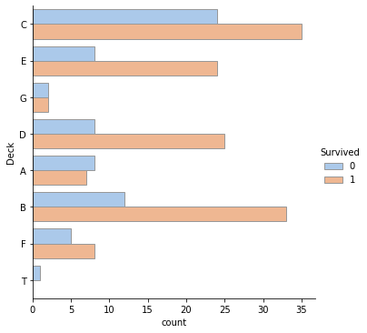
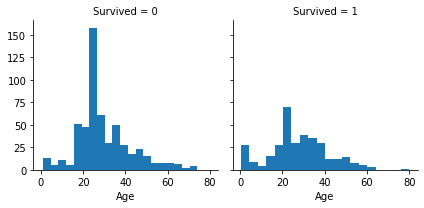
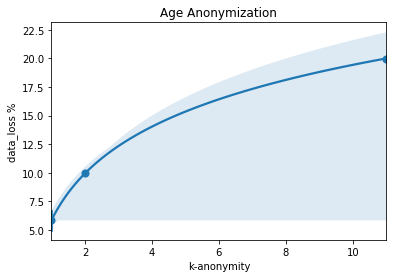
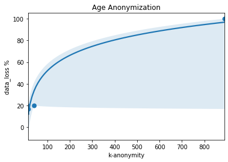
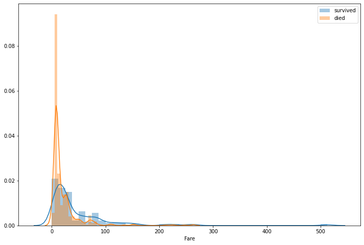
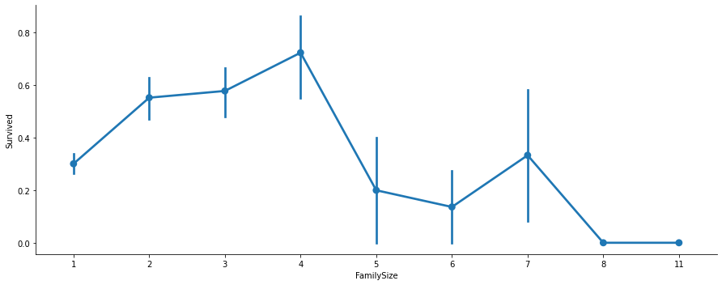
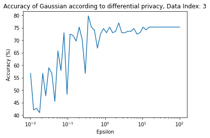

# **Data Anonymization for Privacy vs. Utility**

---
## Jupyter Notebooks

1. [Anonymization](https://github.com/ahrimhan/data_anonymization/blob/master/anonymization_titanic.ipynb)

2. [Machine Learning Models](https://github.com/ahrimhan/data_anonymization/blob/master/ML_titanic.ipynb)

## Goal

In this project, I aim to do hands-on-experience on de-identifying sensitive data using various anonymization techniques and observe the effects of accuracy on machine learning models.

## Data

This is Kaggle competition data
to predict if a passenger survived the sinking of the Titanic or not.
You can download the here. [[Titanic data]](https://www.kaggle.com/c/titanic/data)

All used data and obtained results in this project can be downloaded here. [[Data download]](https://drive.google.com/drive/folders/1ufkU7MC-tMf4JP9uCMhTiJot8DpL1Wu6?usp=sharing)

Here are simple explanation for data.
>Variable|	Definition|	Key
>--- | ---| ---
> PassengerId | Passenger ID |
>Survived| Survival |	0 = No, 1 = Yes
>Pclass|	Ticket class|	1 = 1st, 2 = 2nd, 3 = 3rd
>Sex	|Sex|	male, female
>Age|	Age in years	|
>Sibsp|	# of siblings / spouses aboard the Titanic	|
>Parch	|# of parents / children aboard the Titanic	|
>Ticket|	Ticket number	|
>Fare|	Passenger fare	|
>Cabin	|Cabin number	|
>Embarked|	Port of Embarkation	|C = Cherbourg, Q = Queenstown, S = Southampton

## Trade-off: Privacy vs. Utility

### Anonymity Measure (k-anonymity, l-diversity)

A **k-anonymized data** set has the property that each record is similar to at least another **k-1 other records** on the potentially identifying variables.

The more specific definition can be found here.
> El Emam, Khaled, and Fida Kamal Dankar. “Protecting privacy using k-anonymity.” Journal of the American Medical Informatics Association : JAMIA vol. 15,5 (2008): 627-37. [DOI](doi:10.1197/jamia.M2716)

Higher values of *k* imply a lower probability reidentification.  
But large *k* also means that data is more distorted, so there would be  greater information data loss, which results in low accuracy of prediction model and degrades the utility of data.  

In short, there are trade-off relationship between privacy and utility.
As the data gets harder to be reidentified (privacy level goes "up"), the data gets less useful (utility level goes "down").

Therefore, it is important to find the proper *k*.

### Information Loss
I used the concept of the **information loss** [(from Cryptonumerics page)](https://docs.cryptonumerics.com/cn-protect-ds/?page=docs.cryptonumerics.com/cn-protect-ds-html/overview.html) and implemented it.

Information loss is a measure of the average amount of information removed by making the data more general. This metric is used to minimize the amount of generalization applied to the data, while satisfying the privacy constraints.

## Anonymization Techniques

### 1. Suppression

#### 1.1 Delete columns: "PassengerId", "Ticket" and "Cabin"

* "PassengerId" is personal data, and it has unique values for every row. I delete this attribute.
* "Ticket" does not seem to give useful insight for predicting the survival. "Ticket" is not directly related to personal data, but it has unique 681 records (out of 891 records). In this case, when joined/combined with other public and multiple resources, it is risky to reveal personal information. I decide to delete "Ticket" attribute.
* I could find that the cabins starting with `C` and `B` have most number of survivals. But, in the cabin of `C`, there was also significant number of dying people. In the perspective of the survival ratio, the cabins of `D` and `E` have the highest rates.  
"Cabin" has too many missing values (data existing 204 out of 891 records), so we delete this attribute.


### 2. Generalization: Bucketing

#### 2.1 Generalize the range of values: "Age"

I provide age distribution and histogram on the counts of survived or not according to passengers' ages.

* Infants (Age <=3) had high survival rate.
* Large number of 15-25 year olds did not survive.
* Most passengers are in 15-35 age range.



**Auto Bucketing**

The "Age" columns have been generalized according to the various total number of bins (bins = 5, 10, 15, 20).

anonymization	| k-anonymity |	data_loss %
---|---|---
Age_bin20	|1	|5.00
Age_bin15|	1|	6.67
Age_bin10	|2|	10.00
Age_bin5|	11	|19.99



**Auto Bucketing Anonymization Results**:

Please not that the small number of total number of bins indicates that each bin size gets bigger and more coarse grained data is retained.
On the other hand, as the total number of bins increases, each bin size gets smaller and more fine grained data is retained.

I could observe the as the **total number of bins decreases (each bin gets larger and more coarse)**, the percent of data loss increases (in other hand, **accuracy decreases**) while the k-anonymity measure increases as there are more same records (**privacy increases**).

When the total number of bins is 5, we get the k-anonymity of 11 and the data loss of 19.99%, which seems reasonable level of the anonymization.

**Manual Bucketing**

By referring the age distribution, I categorize the age groups manually (number of bins = 1, 5, and 8).

To see the extreme case, I made the one bin, and it apparently shows that k-anonymity of 889 (i.e., an age has 889 records which are the entire records of a dataset) and the loss of data is 100%.

When the number of bins is 5, we set the specific age ranges into age groups. We made two groups where only infant age ranges are different:
* Infant: 0\~4 (`Age_man_bin5`) | 0\~1 (`Age_man_bin5_v2`)
* Kid_Teen: 5\~20
* Young Adult: 21\~34
* Middle-Aged Adult: 35\~55
* Senior: 56\~80.  
It is good to substitute the range of age into the age category because we can hide the specific and anonymize age.

To see the effect of the more fine grained level of age group, we also use the number of bins of 8.

anonymization	|k-anonymity|	data_loss %	|category|	bin range (,]
  ---|---|---|---|---
Age_man_bin1|	889	|100.00|	[One]|	[-1, 80]
Age_man_bin5	|39	|19.95|	[Infant, Kid_Teen, Young_Adult, Middle_Aged_Ad...	|[-1, 4, 20, 34, 55, 80]
Age_man_bin5_v2|	14|	20.98	|[Infant, Kid_Teen, Young_Adult, Middle_Aged_Ad...	|[-1, 1, 20, 34, 55, 80]
Age_man_bin8	|14	|12.25|	[0-1, 2-12, 13-20, 21-30, 31-40, 41-50, 51-60,...|	[-1, 1, 12, 20, 30, 40, 50, 60, 80]



**Manual Bucketing Anonymization Results**:

* `Age_man_bin5` and `Age_bin5`:  
When compared to the auto bucketing of the number of 5 (`Age_bin5`), which has the k-anonymity of 11 and data loss of 19.99%, the manual bucketing of the number of 5 (`Age_man_bin5`) has larger k-anonymity of 39 and more less data loss of 19.95%. **This manual bucketing indicates stronger privacy and higher (or similar level of) utility of data.**

* `Age_man_bin5` and `Age_man_bin5_v2`:  
When adjusting the first bucket of age (i.e., infant: (-1, 4] (`Age_man_bin5`) --> (-1, 1] (`Age_man_bin5_v2`)),
the age group of (-1, 1] becomes the significant feature by relating to the high survived rate (0.857143). This attribute can be an important indicator when building prediction model for survivals. However, the k-anonymity is decreased to 14, and data loss slightly increased to 20.98%.

* `Age_man_bin5` and  `Age_man_bin8`:  
When using the `Age_man_bin8` bins, the data loss decreased to 12.25% and the k-anonymity is 14, while retaining the infant age range (-1, 1] indicating the high survived rate (0.857143).

* **Conclusion**:  
The anonymization level has to be controlled by the privacy policy/goal/situation.
  * If we need sufficient high number of k-anonymity, we need to sacrifice data loss.
  * If we need minimum loss of data, we may get low number of k-anonymity.  

  Let's say we will anonymize data as following condition: k-anonymity > 10 and data_loss < 20%. The satisfying anonymizations are `Age_man_bin5` and `Age_man_bin8`. Since the infant (age 0~1) has high correlation with the `Survived` in `Age_man_bin8`, we choose this attribute as the representative of the "Age".

#### 2.2 Generalize the range of values: "Fare"



Fare_bin	| Survived rate
---|---
Expensive|	0.700000
Moderate|	0.566502
Cheap	|0.316817

#### 2.3 Generalize the range of values: "Familysize" = "SibSp" + "Parch"



FamilySize_bin|	Survived rate
---|---
Small	|0.578767
Alone	|0.300935
Large|	0.161290

**Anonymization Result**

anonymization|	k-anonymity|	data_loss %|	category|	bin range (,]
---|---|---|---|---
FamilySize: No Anonymization|	6|	0.00|	Numeric	|[0, 1, 2, 3, 4, 5, 6, 7, 8, 9, 10, 11]
FamilySize_bin: [Alone, Small, Large]	|62	|18.87|	[Alone, Small, Large]|	[0, 1, 4, 11]

#### 2.4 Generalize the strings or enumerated values: delete "Name" and new column "Title"

Title	| Survived
---|---
Mrs	|0.792000
Miss|	0.701087
Master|	0.575000
Rare|	0.347826
Mr|	0.156673

**Anonymization Result**
k-anonymity of the attribute "Title": 23
k-anonymity of the attribute "Name": 1

### 3. Synthetic Data

I produced the synthetic data for the categorical type according to the distribution of original data.
However, the generated data did not produce the accuracy as much as the original data in prediction models.

The synthetic data seems to build a poor quality prediction model.
For building prediction models, **I recommend to use other anonymization techniques and NOT to use synthetic data.**

### 4. Pseudonymization

#### 4.1 Label Categorical Attributes and Retain the Lookup Table

I transformed the categorical values in "Sex" and "Embarked" into other forms of numeric values for building machine learning models for prediction.
The sensitive data can be replaced to artificial numbers and
these linked information can be stored as lookup tables.
The lookup tables should be stored safely by encrypted or in another storage in practice.

I used two layers of the lookup tables: random number and encoding from 0 to n.
* The first lookup table links each category value to randomly generated number  
* The second lookup table links these random numbers to 0 to n.

The random number makes adversary hard to attack the data because pseudonyms and tokens are hard to be identified. In addition, two layered lookup tables keep data even more secure. When data is used for machine learning models for prediction, it should be encoded into 0 to n; because,
in the categorical attribute, it should not contain numerical relations.
It might be a good idea if label encoding is substituted by the one hot encoder.

### 5. Swapping
I aim to provide the anonymized data for the survival prediction using machine learning techniques. We do not use the Titanic data for aggregation purpose, therefore, each record is important for prediction. In this project, I do not attempt to use the swapping method.

### 6. Perturbation
The main purpose of data analysis in this project is to make a accurate prediction model, so I did not use the perturbation technique here.

## Accuracy on Machine Learning Models
We built machine learning models using classification techniques.
The results are ordered by "Score(Train Set)" in the descending order.

|Data_Index |Data	| Score(Train Set)|	Score_Model	| Accuracy(Test Set) |Accuracy_Model|
|---|--- | ---| --- | ---|---|
0|	['Fare' 'FamilySize' 'Age']	|97.05|	acc_random_forest_score|	80.34|	acc_random_forest|
3	|['Fare' 'FamilySize_bin' 'Age']|	96.77|	acc_random_forest_score|	83.15|	acc_random_forest|
6	|['Fare_bin3' 'FamilySize' 'Age']|	94.80	|acc_random_forest_score|	76.40|	acc_random_forest|
9|	['Fare_bin3' 'FamilySize_bin' 'Age']|	94.66|	acc_random_forest_score|	76.40	|acc_decision_tree|
1|	['Fare' 'FamilySize' 'Age_man_bin8']	|93.81|	acc_random_forest_score|	80.34	|acc_decision_tree|
2	|['Fare' 'FamilySize' 'Age_man_bin5']	|93.53|	acc_random_forest_score|	85.39	|acc_decision_tree|
4	|['Fare' 'FamilySize_bin' 'Age_man_bin8']|	93.11|	acc_random_forest_score	|81.46|	acc_random_forest|
5	|['Fare' 'FamilySize_bin' 'Age_man_bin5']	|92.69|	acc_random_forest_score|	84.27	|acc_decision_tree|
7	|['Fare_bin3' 'FamilySize' 'Age_man_bin8']	|89.17|	acc_random_forest_score	|78.09	|acc_svc|
8	|['Fare_bin3' 'FamilySize' 'Age_man_bin5']	|87.90|	acc_random_forest_score	|82.02|	acc_svc|
10|	['Fare_bin3' 'FamilySize_bin' 'Age_man_bin8']|	87.62|	acc_random_forest_score|	82.02|	acc_svc|
11|	['Fare_bin3' 'FamilySize_bin' 'Age_man_bin5']|	85.94|	acc_random_forest_score	|85.96	|acc_svc|
13	|Synthetic data: ['Age_man_bin5', 'Fare_bin3', ...|	81.62|	acc_random_forest_score	|57.00|	acc_log|
12|	Synthetic data: ['Age_man_bin8', 'Fare_bin3', ...	|79.25|	acc_random_forest_score	|64.00	|acc_log|

### Results from the "Score"  
The "Score" is measured using training data. The "Score" represents how the model is fitted into train data.

Please note that the abstraction and anonymized levels are categorized into 4 layers as below. We denote dataset 1 ~> dataset 2as dataset 2 is more abstracted and anonymized than dataset 1.

All numeric features: 0
Two numeric and one anonymized features: 1 ~> 2, 3, 6
One numeric and two anonymized features: 4 ~> 5, 7 ~> 8, 9
All anonymized features: 10 ~> 11
We could observe the trends that the lower index of datasets (more accurate data) produces the higher accuracy scores, while the higher index of datasets (more anonymized and loss data) produces the lower accuracy scores. In other words, we can say that the high abstraction strongly correlates to the low accuracy of model.

For example, the highest ranked model was based on the random forest model with data of index 0 with all numeric features with the accuracy of 97.05%. The second highest ranked model was the data of index 3, consisting of all numeric features of fare and age except family size, with the accuracy of 96.77%. The datasets of index 10 and index 11 are composed of all categorical features (in which data had been anonymized and abstracted) and produces least results of accuracy of 87.62% and 85.94%, respectively.

The second layer of abstraction (two numeric and one anonymized features; index: 1,2,3,6) ranks second best group.

If all the other variables are the same and there is an abstraction level difference in one variable, we can observe that the rank order of accuracy is maintained in all cases.

For instance, 'Age_man_bin5' is more abstracted than 'Age_man_bin8', and the models containing 'Age_man_bin5' instead of 'Age_man_bin8' have lower model accuracy (e.g., model accuracy of dataset of index: 1 > 2, 4 > 5, 7 > 8, and 10 > 11).

## Differential Privacy
At the intuition level, differential privacy provides the nice privacy guarantee by adding noises to the returning results.

**k-anonymity limitations:**

In practice, there are some issues for using k-anonymity.    
In particular, when an attacker knows some side-information about individual, it is not guaranteed that the data is preserving the privacy.

* Homogeneity attack:  
This attack leverages the case where all the values for a sensitive value within a set of k records are identical. In such cases, even though the data has been k-anonymized, the sensitive value for the set of k records may be exactly predicted.

* Background knowledge attack (= Linkage attack):  
This attack leverages an association between one or more quasi-identifier attributes with the sensitive attribute to reduce the set of possible values for the sensitive attribute

### Trade offs between Epsilon ε (privacy loss) vs. Data Loss

Differential privacy libraries implement various techniques that take an epsilon parameter as input and adds **random noise** to values in the original dataset, proportionally to the given ε parameter. Thus, the smaller the epsilon value, the more noise will be added to the values.

- If ε is small, then more privacy is preserved but data accuracy gets worse.  
- If ε is large, privacy will be worse but data accuracy will be preserved.

### Epsilons ε (Privacy loss control parameter)

- Dataset index: 0 ~ 11
- Epsilons
```
epsilons = np.logspace(-2, 2, 50)
```
- Each dataset, Gaussian Naive Bayes models with different parameters of Epsilon are built.

We can clearly observe that as the epsilon value gets larger (privacy gets worse), the model accuracy is increased.



### Control Privacy Level

We may want the model accuracy in a certain level to keep epsilon value as small as possible (i.e., privacy is preserved).

For example, let's say we want the model accuracy above 80%.

In each dataset, the results retrieve the model with smallest epsilon value. There can be the data that has no model above the specified accuracy.

The highest accuracy using Gaussian Naive Bayes model is 82.02.
The two models with index 2 and 7 produces the highest result.
Here, we choose the model with index 7 because its epsilon is smaller than the model with index 2 (0.03 < 1.33).
The epsilon value gets smaller, the more privacy is preserved.

data_index|	model_acc	|epsilon	|epsilon_idx
---|----|----|----
1	|80.34|	0.24	|17
2	|82.02|	1.33	|26
4	|80.34|	0.52	|21
6	|80.34|	0.52	|21
7	|82.02|	0.03	|6
8	|80.34|	7.20|	35
11|	81.46|0.03	|6
